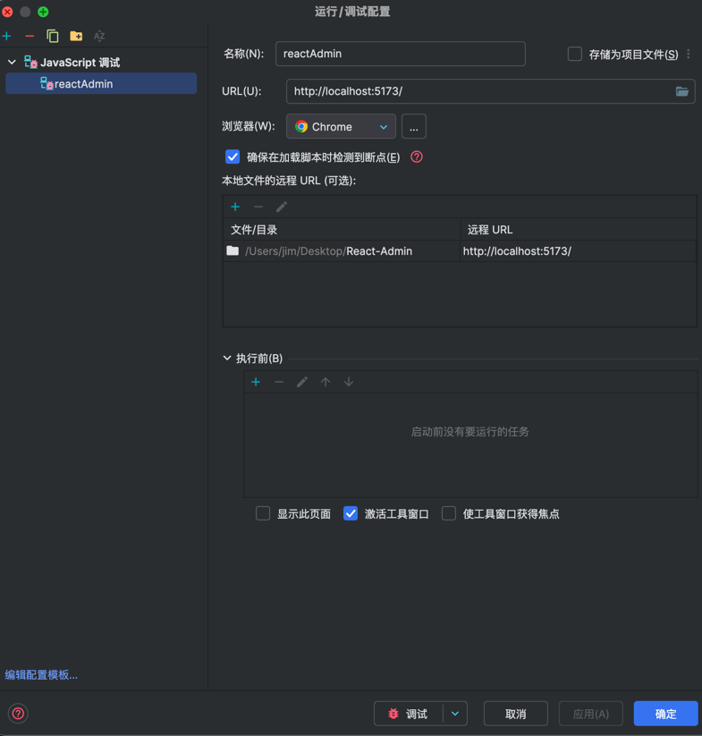

## 项目启动
1. 使用17以上node版本 （nvm alias default 18）- 设置默认node18 版本
  - "error when starting dev server:
ReferenceError: structuredClone is not defined" 表示node版本过低，请升级node版本
2. 安装依赖包 pnpm install
3. 启动项目 pnpm run dev


## webstorm 代码调试断点
- 配置


## 生产开发环境切换运行醒目
1. env.development 和 .env.production 文件创建
2. vite --mode development ｜ vite --mode production （package.json）
3. npm run build && npm run preview (package.json)


## .prettierrc
// "semi": false, // 句末不使用分号
// "tabWidth": 2, // 缩进字符数
// "useTabs": false, // 使用空格代替tab缩进
// "printWidth": 120, // 超过最大值换行
// "singleQuote": true, // 使用单引号替换双引号
// "bracketSpacing": true, // 在对象中括号内添加空格
// "quoteProps": "as-needed", // 对象属性名是否要加引号
// "jsxSingleQuote": true, // jsx中使用单引号代替双引号
// "jsxBracketSameLine": true, // jsx中> 置于同一行
// "proseWrap": "preserve", // 是否需要换行
// "trailingComma": "none", // 在对象或数组最后一个元素后面是否加逗号
// "arrowParens": "avoid" // 箭头函数参数只有一个时是否要有小括号 avoid: 省略括号


## 自动变基
- git config --global pull.rebase true
- 保持git提交线 整齐性，可减少merge


## 双token （用于用户token 登陆到期，又不想重新登陆）
- 何时触发
1. 页面弄个按钮      错误

2. Axios 请求拦截器     【提前操作】
   提前判断 token 是否要过期
   未过期：无需额外操作
   将要过期：
   1. 将当前正在发送的请求给暂停，追加到一个请求队列中 【如何暂停】
   2. 发送刷新token的请求
   等待完成
   1. 将最新token给存下来
   2. 将请求队列中暂停的请求重新开启（修改之前的旧token）
   
3. Axios 响应拦截器     【后处理】
   根据http状态码401或业务状态码判断是否过期
   未过期：无需额外操作
   已过期：
   1. 发送刷新token的请求
   等待完成
   1. 将最新token给存下来
   2. 将刚才出错的接口再调用一次


## promise 本身是同步的 resolve() 或 reject是异步执行的
- 会先执行 push操作，然后 resolve 放到微任务队列等待执行

```js
return new Promise(resolve => {
  this.queq.push(function(newToken) {
// 处理旧token
    config.headers.Authorization = newToken
    resolve(config)
  })
})
```


